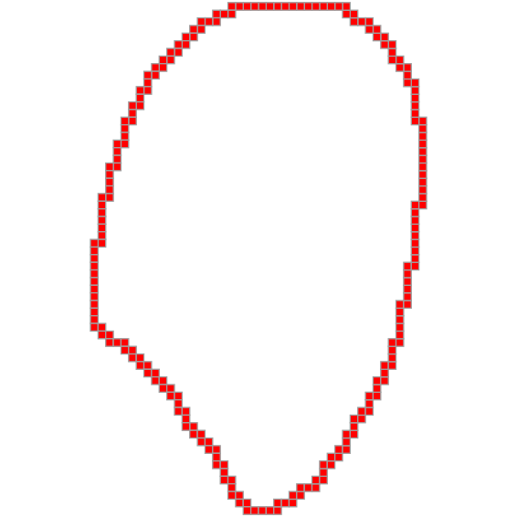
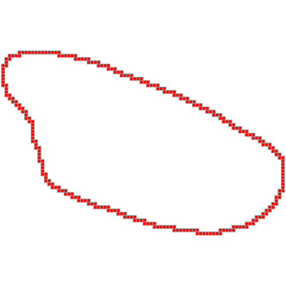
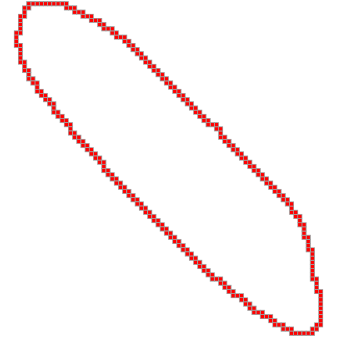
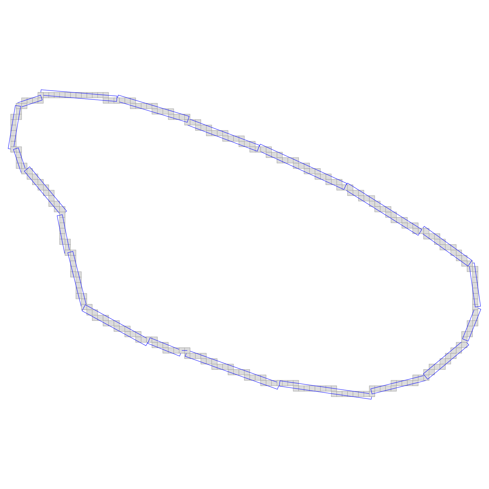
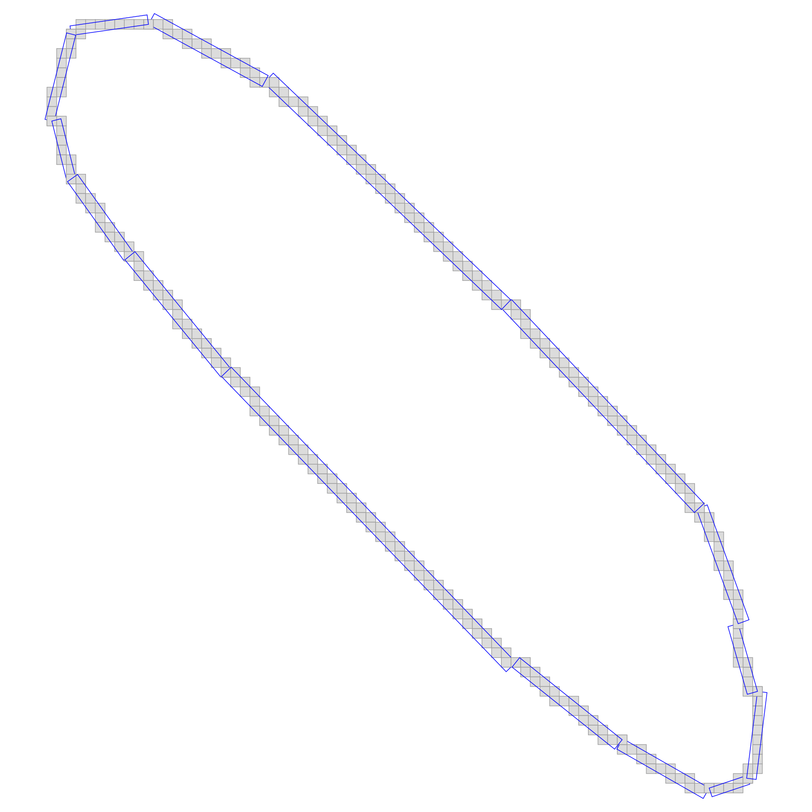
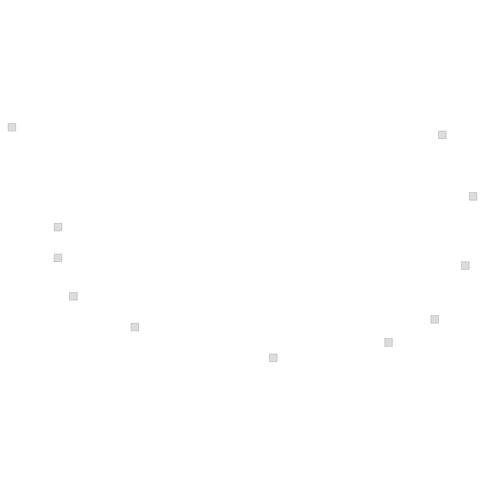
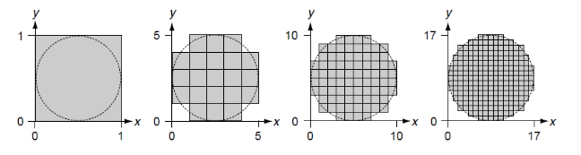
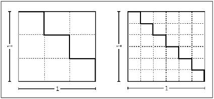

# TP1


### COMPILATION

To run this project, you'll need to be located at the root.

Open a Terminal

Create a build folder

```sh
mkdir build
```

Go to this folder

```sh
cd build
```

Compile 

```sh
cmake ..
make
```

Run it

```sh
./main
```


### STEP 1: DOWNLOAD AND OBSERVE SEGMENTED IMAGES


**Basmati Rice :** 

The Basmati rice seem to have grains realy long and straight. Streched shape.


**Camargue rice :** 

The Camargue rice grains seems more rounded, less long than the Basmati ones.


**Japanese rice :** 

Japanese grains are even more rounded, if the Camargue grains have still an oval shape, here it looks like circles.


--------------

### STEP 2: COUNT GRAINS


By running the code on all the segmented pictures I found the following values :


**Japanese Segmented :**  number of components : 147

**Camargue rice :**  number of components : 132

**Basmati Rice :** number of components : 141


The Basmati binary image seems to not be well-composed image. There are some patterns on the image that wouldn't be the same for both 4-components andd 8-components.

We can say the same for the two others .

By inverting the current pair of addjency (4 foreground - 8 background) to (8 foreground - 4 background)


**Japanese Segmented :** number of components : 135 (-9 %)

**Camargue rice :** number of components : 111 (-16 %)

**Basmati Rice :** number of components : 116 (-18 %)


The one with the biggest gap is Basmatin then Camargue and Japanese.


--------------


### STEP 3: EXTRACT DIGITAL OBJECT BOUNDARY


By applying my getBoundary() function on the different segmented images, I could get theses results (SVG images).


---------------
**Japanese**



<p style="text-align: center;"><b>Figure</b> : Japanese Grain</p>
<br>

---------------

**Camargue**



<p style="text-align: center;"><b>Figure</b> : Camargue Grain</p>
<br>

---------------
**Basmati**



<p style="text-align: center;"><b>Figure</b> : Basmati Grain</p>
<br>


### Step 4 : POLYGONIZE DIGITAL OBJECT BOUNDARY


**Japanese**

Normal : 


<p style="text-align: center;"><b>Figure</b> : Polygonized Japanese Grain</p>
<br>


<p style="text-align: center;"><b>Figure</b> : Multiple poligonized Japanese Grains</p>
<br>


DrawLine() version : 


<p style="text-align: center;"><b>Figure</b> : Japanese Grain (Draw Line Version)</p>
<br>


<p style="text-align: center;"><b>Figure</b> : Multiple Japanese Grains (Draw Line Version)</p>
<br>

*Freeman Chain :* 1292 1112 30303033033033030300001001010010110101011011010110110110111011111011111011111111011111111111211111211212112121212212122222222222222232232232323232323232332332332333233323333233333323333333333303030030303030303030330330

---------------
**Camargue**

Normal : 



<p style="text-align: center;"><b>Figure</b> : Polygonized Camargue Grain</p>
<br>


<p style="text-align: center;"><b>Figure</b> : Multiple Polygonized Camargue Grains</p>
<br>

DrawLine() version : 


<p style="text-align: center;"><b>Figure</b> : Camargue Grain (DrawLine version)</p>
<br>


<p style="text-align: center;"><b>Figure</b> : Multiple Camargue Grain (DrawLine version)</p>
<br>

*Freeman Chain :* 974 270 3000300300030003000300000030000000300000001000010000100101001010101011011011111111112121212122121221221221221212212122122122122122122122122212212221221222122212212212221222122221222221222222222222322232332333333033303030303030330303333330330333303333033030300300300300300030030000

---------------
**Basmati**




<p style="text-align: center;"><b>Figure</b> : Polygonized Basmati Grains</p>
<br>


<p style="text-align: center;"><b>Figure</b> : Multiple Polygonized Basmati Grains</p>
<br>


DrawLine() version : 


<p style="text-align: center;"><b>Figure</b> : Multiple Basmati Grain (DrawLine version)</p>
<br>


*Freeman Chain :* 864 1116 3003030030030000010101111111121112111111121112111211212112121212121212121212121212121212121121221212121212121212121212121212121212121212122121221212212212212212222222223233233332333033330330330303303030303303030303303030303030303033030303030303030303030303030303030303030303030303030300303030300303030300


--------------


### Step 5 : CALCULATE AREA


#### Question 1)

As it is said that the amount of 2-cells in a digital object is equal to its number of cells, we can find the value by calling its size() method.

I got the following area :

**Japanese**
```
AREA : 

From grid points : 2018
```


**Camargue**

```
AREA : 

From grid points : 2365
```

**Basmati**

```
AREA : 

From grid points : 1948
```
 

#### Question 2)

As I searched for a way to retrieve information about the rectangle shapes of the DSS, I found two methods that retrieved the leaning points of a Primitive object : Uf() and Ul().

I iterated over the DSS and printed the points I got with these methods to obtain the following results.

UF : 



UL :


BY running my programm, I got the following statement :

```
Shoelace computation for the following points : 
(992, 1200)
(998, 1187)
(998, 1183)
(1000, 1178)
(1008, 1174)
(1026, 1170)
(1041, 1172)
(1047, 1175)
(1051, 1182)
(1052, 1191)
(1048, 1199)
Area Version Polygon Shape (UF) : 303144

Shoelace computation for the following points : 
(995, 1195)
(998, 1187)
(999, 1179)
(1007, 1174)
(1026, 1170)
(1038, 1171)
(1046, 1174)
(1050, 1179)
(1053, 1189)
(1049, 1198)
(1048, 1199)
Area Version Polygon Shape (UL) : 282165
```

I found, the difference between the two methods was significant, thus I looked for another method, after fixing many bugs in my code I implemented a better version using the first points of each segments of the decomposition.

```
========= New Grain ==========

AREA : 

From grid points : 2037     // First method
From Polygon shape : 2091   // Second method
```


#### Area discussion

In fact, those methods due to the fact that the results depends on the grid resolution we are using. The more squares are present in the grid, the more precise would be our results, this would increase the area value and make it converge more and more.

<br>

<p align="center">
  
</p>


<p style="text-align: center;"><b>Figure</b> : Explanation of multigrid convergence</p>

<br>

The first area computation method counts the amount of squares inside the digital object it fits totally with the multigrid convergent property.

However, the second one take points and make a computation based on it. At least we can also say that this method keeps the multigrid convergent property. 
In fact, due to the points are taken after we poligonized the digital object and this polygonization is based on the grid resolution, the best resolution we have for our grid in the polygonization process, the best result we are going to have in the Shoelace computation.


#### Distribution (Made on Polygonized area)

I put all the values in a single vector (C++ array) and then made statistical distributions on it.

Thanks to that I got these outputs : 

**Japanese**

```
< AREA > 
Mean : 1991.38
SD : 282.473
Range : 2054
```


**Camargue**

```
< AREA > 
Mean : 2448.51
SD : 781.832
Range : 3274
```


**Basmati**

```
< AREA > 
Mean : 2086.2
SD : 594.336
Range : 3780
```

We can see that the bigger grains come from the Basmati types, however the difference are'nt enought to say that theses difference are signficant. The standard deviation are too big to make sure a grain is of a specific king of grain rice.

Thus wa can say that the area isn't the principal component for classification.


### Step 6 : CALCULATE PERIMETER


#### Question 1)

The first method requires the boundary points of the digital object. Then we can get the perimeter thanks to the its size.

**Japanese**
```
Perimeter : 

From Boundary : 218
```


**Camargue**

```
Perimeter : 

From Boundary : 284
```

**Basmati**

```
Perimeter : 

From Boundary : 338
```

#### Question 2)

Then, we can also compute the perimeter with the points of the polygonized digital object. The perimeter is defined as the sum of the sides distances. So I computed the sum of the distances between two following points.

I used the euclidean distance for the distances.

```cpp
double euclideanDist(double x1, double y1, double x2, double y2)
{
    return sqrt(pow(x2 - x1, 2) + (pow(y2 - y1, 2)));
}
```

I got : 


**Japanese**
```
Perimeter : 

From Boundary : 218             // First method
From Polygon shape : 174.438    // Second method
```


**Camargue**
```
Perimeter : 

From Boundary : 306             // First method
From Polygon shape : 236.49     // Second method
```


**Basmati**
```
Perimeter : 

From Boundary : 306             // First method
From Polygon shape : 236.49     // Second method
```


#### Perimeter Discussion


The first method (Counting the 1-cells) can't keep the multigrid convergence property. In fact, computing 1-cells is simular to a distance calculation. 

The grid resolution won't change theses distances, it would only increase the amount of unity (squares).

The following figure, show us that increasing the number of two cells doesn't influence the distance.

<br>

<p align="center">
  
</p>

<p style="text-align: center;"><b>Figure</b> : Example of none-multigrid convergence</p>

<br>

However, the second method (perimeter calculations thanks to points of polygon shape), keeps this principle (of multigrid convergence), due to the previous computation of its polygon shape, the grid resolution impact the decomposition and make it more precise with better resolution. Then we make computation of perimiter on the basis of theses points previously calculated.

#### Distribution  (Made on Polygonized perimeter)


**Japanese**

```
< PERIMETER > 
Mean : 170.8
SD : 12.0927
Range : 108.662
```

**Camargue**

```
< PERIMETER > 
Mean : 202.267
SD : 40.1525
Range : 193.357
```

**Basmati**

```
< PERIMETER > 
Mean : 220.67
SD : 40.1303
Range : 268.711
```


We can have the same conslusion as for the area with the perimeter here. Perimeter can't be the principal component of classification.

### Step 7 : PROPOSE AND CALCULATE CIRCULARITY


**Personnal definition**

I'd define circularity as the perfect balance between area and perimeter values. In fact, if the perimeter were very proportionnal, we could put ouf shape inside a square, it would be perfectly included inside.


**Definition found on internet**

" The circularity symbol is used to describe how close an object should be to a true circle. Sometimes called roundness, circularity is a 2-Dimensional tolerance that controls the overall form of a circle ensuring it is not too oblong, square, or out of round. " (https://www.gdandtbasics.com/circularity)


Moreover I found the following formula : 


$$Roundness =  \frac{\text{Perimeter}^2}{4\pi \cdot \text{Area}} $$

The shorter to **1** value we are, the more circular our shape is, otherwise it is higher than 1.

The following code give us the circularity thanks to the area and perimeter

```cpp
float getCircularity(float area, float perimeter){
    return pow(perimeter, 2) / (4 * M_PI * area);
}
```

#### Distribution

**Japanese**

```
< CIRCULARITY > 
Mean : 1.18141
SD : 0.0892094
Range : 0.676149
```

**Camargue**

```
< CIRCULARITY > 
Mean : 1.44747
SD : 0.47279
Range : 4.54117
```

**Basmati**

```
< CIRCULARITY > 
Mean : 1.96881
SD : 0.588655
Range : 5.35514
```


The means of the three kinds of rice are quite different, it seems that even the standard deviation tell us that if we took the biggest japanese rice we wouldn't reach the camargue or basmati standards.

It seems that more of the area or perimeter, the circularity give us a great idea of a way of classification of rice types.


### Step 8 (OTPIONNAL) : FIND USEFUL MEASURES FOR THE GRAIN CLASSIFICATION

I already see the distributions of the previous measurements (area, perimeter, circularity)

The measurement I could add to make it easier for the classification is the calculation of max/min values (for each type) to see if one of its grain could be part of other type standards.

Moreover, I'd add, measurements of quartiles to better see te distribution of the grains, and finnaly, I'd make one that would get the amount of grains of a type that are inside other types standards


**For example :**

If we have biggest and thinner Japanese rice with such area, perimeter and circularity that it could be interpreted as a Basmati one for example, then I want to know the amount of the Japanese rices that looks an Basmati (of Calargue) ones.