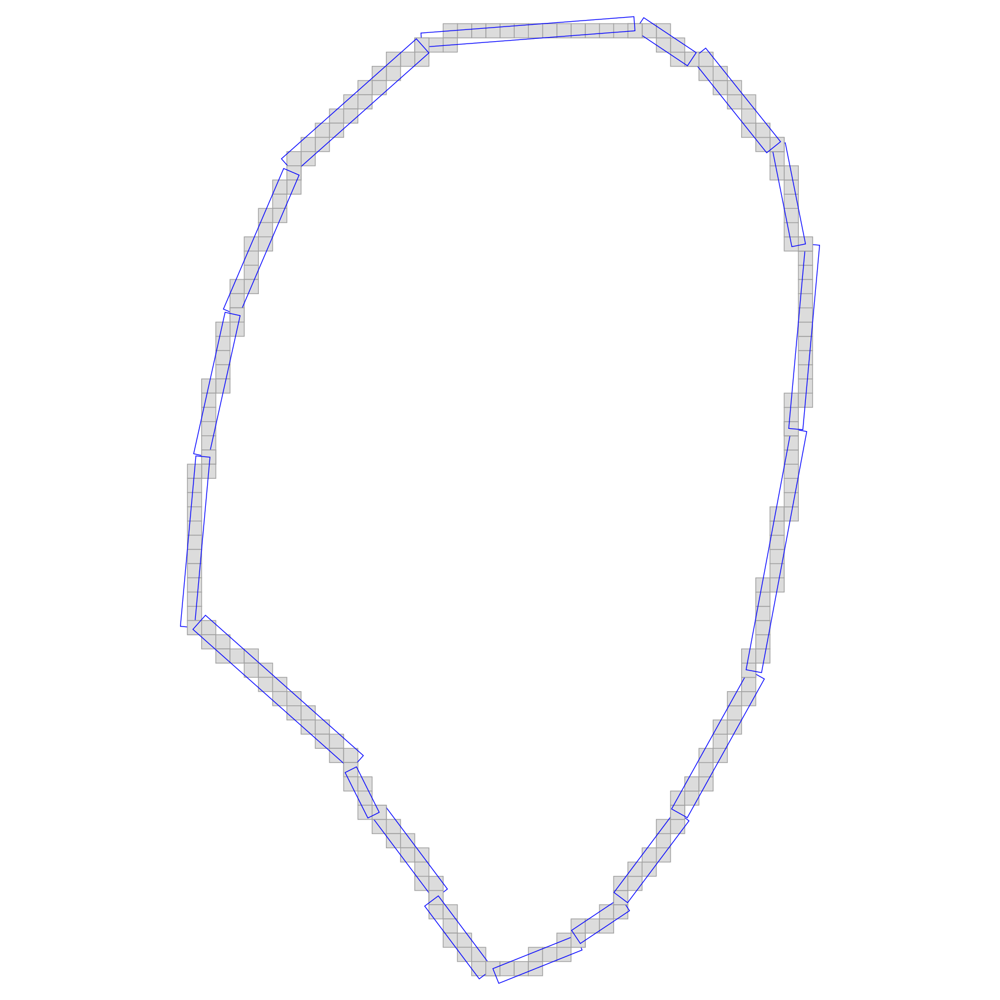
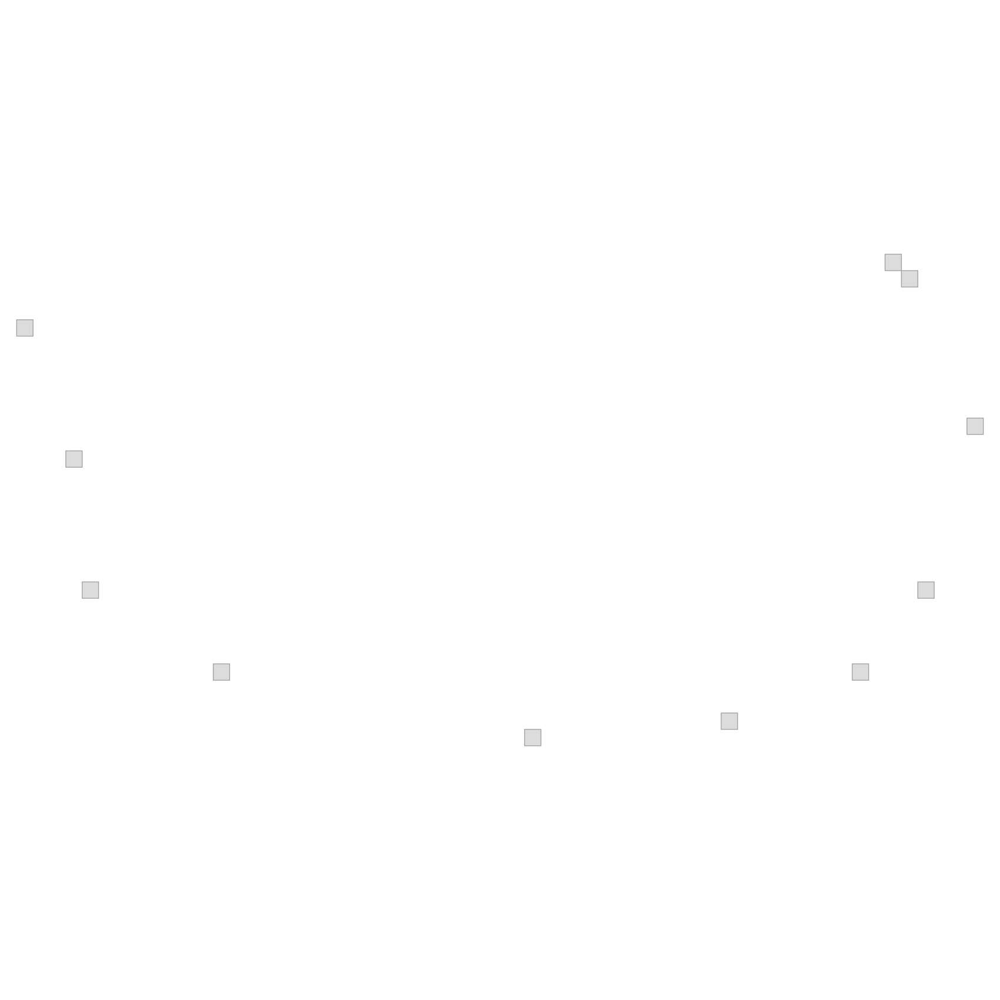

# TP1

### STEP 1: DOWNLOAD AND OBSERVE SEGMENTED IMAGES


**Basmati Rice :** 

The Basmati rice seem to have grains realy long and straight. Streched shape.


**Camargue rice :** 

The Camargue rice grains seems more rounded, less long than the Basmati ones.


**Japanese rice :** 

Japanese grains are even more rounded, if the Camargue grains have still an oval shape, here it looks like circles.


--------------

### STEP 2: COUNT GRAINS


By running the code on all the segmented pictures I found the following values :


**Japanese Segmented :**  number of components : 147

**Camargue rice :**  number of components : 132

**Basmati Rice :** number of components : 141


The Basmati binary image seems to not be well-composed image. There are some patterns on the image that wouldn't be the same for both 4-components andd 8-components.

We can say the same for the two others .

By inverting the current pair of addjency (4 foreground - 8 background) to (8 foreground - 4 background)


**Japanese Segmented :** number of components : 135 (-9 %)

**Camargue rice :** number of components : 111 (-16 %)

**Basmati Rice :** number of components : 116 (-18 %)


The one with the biggest gap is Basmatin then Camargue and Japanese.


--------------


### STEP 3: EXTRACT DIGITAL OBJECT BOUNDARY


By applying my getBoundary() function on the different segmented images, I could get theses results (SVG images).


---------------
**Japanese**


---------------
**Camargue**


---------------
**Basmati**


### Step 4 : POLYGONIZE DIGITAL OBJECT BOUNDARY


**Japanese**

Normal : 




DrawLine() version : 


*Freeman Chain :* 1292 1112 30303033033033030300001001010010110101011011010110110110111011111011111011111111011111111111211111211212112121212212122222222222222232232232323232323232332332332333233323333233333323333333333303030030303030303030330330

---------------
**Camargue**

Normal : 


DrawLine() version : 


*Freeman Chain :* 974 270 3000300300030003000300000030000000300000001000010000100101001010101011011011111111112121212122121221221221221212212122122122122122122122122212212221221222122212212212221222122221222221222222222222322232332333333033303030303030330303333330330333303333033030300300300300300030030000

---------------
**Basmati**


DrawLine() version : 


*Freeman Chain :* 864 1116 3003030030030000010101111111121112111111121112111211212112121212121212121212121212121212121121221212121212121212121212121212121212121212122121221212212212212212222222223233233332333033330330330303303030303303030303303030303030303033030303030303030303030303030303030303030303030303030300303030300303030300


--------------


### Step 5 : CALCULATE AREA


#### Question 1)

As it is said that the amount of 2-cells in a digital object is equal to its number of cells, we can find the value by calling its size() method.

I got the following area : ...


#### Question 2)

As I searched for a way to retrieve information about the rectangle shapes of the DSS, I found two methods that retrieved the leaning points of a Primitive object : Uf() and Ul().

I iterated over the DSS and printed the points I got with these methods to obtain the following results.

UF : 


UL :




BY running my programm, I got the following statement :

```
Shoelace computation for the following points : 
(992, 1200)
(998, 1187)
(998, 1183)
(1000, 1178)
(1008, 1174)
(1026, 1170)
(1041, 1172)
(1047, 1175)
(1051, 1182)
(1052, 1191)
(1048, 1199)
Area Version Polygon Shape (UF) : 303144

Shoelace computation for the following points : 
(995, 1195)
(998, 1187)
(999, 1179)
(1007, 1174)
(1026, 1170)
(1038, 1171)
(1046, 1174)
(1050, 1179)
(1053, 1189)
(1049, 1198)
(1048, 1199)
Area Version Polygon Shape (UL) : 282165
```

I found, the difference between the two methods was significant, thus I looked for another method, after fixing many bugs in my code I implemented a better version using the first points of each segments of the decomposition.

```
========= New Grain ==========

AREA : 

From grid points : 2037     // First method
From Polygon shape : 2091   // Second method
```


#### Area discussion

In fact, those methods due to the fact that the results depends on the grid resolution we are using. The more squares are present in the grid, the more precise would be our results, this would increase the area value and make it converge more and more.

<br>


<p style="text-align: center;"><b>Figure</b> : Explanation of multigrid convergence</p>

<br>

The first area computation method counts the amount of squares inside the digital object it fits totally with the multigrid convergent property.

However, the second one take points and make a computation based on it. At least we can also say that this method keeps the multigrid convergent property. 
In fact, due to the points are taken after we poligonized the digital object and this polygonization is based on the grid resolution, the best resolution we have for our grid in the polygonization process, the best result we are going to have in the Shoelace computation.


#### Distribution

I put all the values in a single vector (C++ array) and then made statistical distributions on it.

Thanks to that I got these outputs : 

MEAN

SD

RANGE


### Step 6 : CALCULATE PERIMETER

